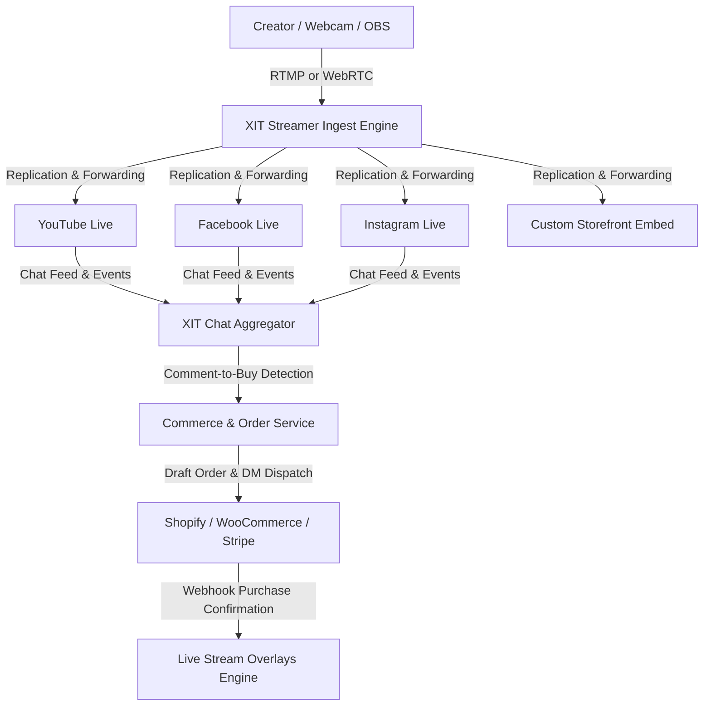

# XIT Streamer: Product & Technical Architecture Masterclass

This reference manual provides a complete, first-principles breakdown of the **XIT Streamer** Creator Operations & Live Shopping platform. It is designed to serve as the definitive blueprint for engineers, product managers, architects, and business leaders.

---

## 1. Product & Business Vision

### Overall Vision
XIT Streamer is an enterprise-grade Creator Operations & Live Shopping Platform. Its goal is to unify multi-platform livestreaming, real-time interactive social commerce, audience moderation, unified analytics, and agency-level talent management into a single, cohesive, high-performance ecosystem. 



### The Business Problems Solved
1. **Audience Fragmentation:** Audiences are split across platforms (YouTube, Instagram, TikTok, Facebook). Multi-platform streaming (simulcasting) typically requires high local upload bandwidth or expensive prosumer tools that offer zero interaction tools.
2. **Chat & Moderation Desynchronization:** Creators must monitor separate chat windows for each platform. Inconsistencies in moderation policies, keyword blacklists, and block lists make it nearly impossible to protect a brand across channels simultaneously.
3. **Friction in Social Commerce (Live Selling):** Traditional live shopping forces users to click external links, leading to massive cart abandonment (up to 75-80%). XIT solves this through **Comment-to-Buy automation**, sending personalized checkouts directly to users' direct messages (DMs) where they already converse.
4. **Lack of Governance for Agencies:** Talent agencies managing dozens of creators have no centralized governance, unified analytics reporting, white-label client tools, or role-based access controls (RBAC) to manage creators' OAuth platform credentials safely.

### Target Users and Use Cases
* **Enterprise Brands & E-commerce Retailers:** Launching product drops simultaneously on Instagram Live, Facebook, and their own online store, letting viewers buy instantly by commenting `#buy-item`.
* **Talent Agencies & Creator Managers:** Managing credentials, scheduling streams, monitoring performance, and compiling sponsor-ready campaign reports for multiple creators.
* **Professional Gamers & Influencers:** Distributing high-definition feeds (1080p60) to YouTube, Twitch, and custom destinations while using an AI Copilot to surface top chat questions and automate chat moderation.

### Competitive Positioning
* **Restream / StreamYard (Prosumer):** Focus on basic multi-platform streaming, simple graphics, or guest WebRTC joins. They lack deep agency management, enterprise RBAC, transactional social commerce tools, and custom webhook-driven web widgets.
* **Sprii.io / Livescale (Pure Live Commerce):** Focus heavily on e-commerce catalog integrations, but lack native multi-platform streaming studios, developer-grade API gateways, advanced AI moderation, and agency governance tools.
* **XIT Streamer (Enterprise Operations & Commerce):** Unifies professional RTMP streaming duplication with real-time Kafka-based chat commerce, advanced AI sentiment models, and multi-tenant agency management.

---

## 2. Screen-by-Screen Application Walkthrough

XIT Streamer is designed as a **density-appropriate** layout. Screens targeting the active stream (Dashboard) are information-dense, dark-mode first, and high-contrast, similar to Datadog or a trading terminal. Administrative screens (onboarding, reporting) use a clean, guided layout.

### 1. Unified Authentication & Workspaces
* **Login/Signup Screen:** Standard email/password, Google/Meta OAuth, and mandatory Multi-Factor Authentication (MFA) via TOTP.
* **Workspace Selector:** Users choose between personal profiles or collaborative agency workspaces.
* **Team Invite Dashboard:** Agency owners invite Managers or Moderators, assigning granular permissions (RBAC).

### 2. Platform Connection Center (OAuth Integration)
* **The Connection Mechanism:** To maximize security and eliminate setup friction, users **do not provide raw API keys** or developer credentials. Instead, connections are established via standard secure redirect handshakes:
  * **Social Accounts:** Clicking "Connect" redirects the user to Google (YouTube) or Meta (Facebook/Instagram) login screens. The user approves the requested permissions, and the social platforms redirect back to XIT with an Authorization Code, which the backend exchanges for long-lived **Access and Refresh Tokens** encrypted with **AES-256** at rest.
  * **E-commerce Stores (e.g., Shopify):** The user enters their store sub-domain (e.g., `brand.myshopify.com`). XIT redirects them to the Shopify App Authorization page where they click "Install App." Shopify issues an offline access token to XIT. (A developer fallback option allows manually pasting custom API access keys for headless storefronts).
* **Connected Accounts Grid:** Displays active integrations.
* **Card Details:** Profile picture, platform tag, token expiry countdown, connection status (Green = Connected, Yellow = Expired, Red = Revoked/Error).
* **Action Tray:** "Reauthorize," "Disconnect," "Verify Connection Health."

### 3. E-commerce Integration Hub
* **Store Connector:** Input Shopify Domain, WooCommerce URL, or custom API keys.
* **Catalog Manager:** Shows a paginated grid of synced products: product image, SKU, description, pricing, inventory stock status, and custom **Purchase Trigger Keyword** (e.g., `#blue-shirt-medium`).

### 4. Stream Creation Studio
* **Stream Details Form:** Title, description, schedule date, visual thumbnail (drag-and-drop crop tool), and category.
* **Platform Selector Toggle Panel:** Enable/disable specific channels. Each toggle expands to reveal platform-specific overrides (e.g., YouTube latency mode, Facebook crossposting groups, Instagram visibility).
* **Product Tagging Selector:** Search catalog and link specific items to the stream, configuring the dynamic purchase code overrides.

### 5. Live Stream Control Center (The Terminal)
This is the master screen during an active live stream. It is structured in a three-column layout:
* **Left Column (Stream Health & Overlays):**
  * Real-time encoding metrics (FPS gauge, audio input meters, bitrate chart, packet loss alerts).
  * Ingest endpoint credentials (Server RTMP URL + Stream Key).
  * Interactive overlay controller (toggles product cards, discount banners, spin-to-win widgets on/off).
* **Center Column (Unified Chat Aggregator):**
  * Real-time scrolling feed containing messages from YouTube, Facebook, and Instagram. Each card displays user avatar, username, color-coded platform badge, comment, and timestamp.
  * Right-click Context Menu: Pin, Highlight on Screen, Delete, Timeout User, Permanent Ban.
* **Right Column (Live Commerce & Analytics):**
  * Live Sales Funnel: Active Viewers, Link Dispatches (DMs sent), Carts Created, Completed Orders, Real-time GMV (Gross Merchandise Value) counter.
  * Product Spotlight Panel: Highlights the current active product card and shows stock remaining.
  * AI Copilot Sidebar: Surfaced audience questions, real-time sentiment analysis meter, and copy-paste suggested chat replies.

---

## 3. Technical Architecture Deep-Dive

### End-to-End Microservices Architecture
XIT Streamer utilizes a containerized, decoupled microservices model orchestrated via Kubernetes (AWS EKS). Communication is handled via REST/GraphQL API Gateway for external requests, and Apache Kafka/Redis Streams for internal event processing.

```
                                  [ Next.js Presentation Layer ]
                                                 | (WebSocket / HTTPS)
                                    [ NestJS API Gateway / Kong ]
                                                 |
         +--------------------+------------------+------------------+------------------+
         |                    |                  |                  |                  |
   [ Auth Service ]   [ Stream Service ]  [ Chat Service ]  [ Commerce Service ] [ Analytics Service ]
         |                    |                  |                  |                  |
    (PostgreSQL)         (Postgres/Redis)  (Kafka/Redis)     (Shopify API/Stripe)  (ClickHouse/Mongo)
```

### Core Services Breakdown
1. **Authentication Service:** Manages multi-tenant credentials, workspace permissions, SAML/SSO integrations, and encrypted OAuth vault storage.
2. **Stream Service & Orchestrator:** Handles stream scheduling, generates ingest endpoints, triggers FFmpeg workers, and monitors stream health.
3. **Chat Aggregation Service:** Houses the platform adapters that poll or read webhooks from YouTube, Facebook, and Instagram, forwarding normalized JSON structures.
4. **Commerce & Order Service:** Manages e-commerce webhook listeners, handles catalog synchronizations, maps comments to SKUs, and issues draft orders.
5. **Analytics Engine:** Ingests high-throughput metric streams (viewers, transactions, chats) and updates memory caches (Redis) and analytical data warehouses (ClickHouse).

---

## 4. Key Workflows & Engineering Implementation

### 1. Stream Ingest & Replication (The Streaming Engine)

XIT Streamer supports three streaming input methods depending on creator preference:
1. **WebRTC Ingest (Zero-Install Browser Studio):** Captures the webcam and microphone directly within Chrome/Safari via HTML5 MediaStream APIs and streams low-latency WebRTC streams to our server, which translates them to RTMP.
2. **Mobile App Ingest (iOS/Android):** Compresses mobile hardware camera frames and streams over RTMP or SRT directly from a mobile phone.
3. **OBS Studio / External Hardware (RTMP Ingest):** Alex copies the RTMP Server URL and Stream Key into professional software (OBS, vMix) or hardware capture cards.

```
[ Ingest Stream (RTMP/WebRTC) ] ---> [ SRS Ingest Server ]
                                             |
                                             v
                                 [ Spawn FFmpeg process ]
                                             |
                +----------------------------+----------------------------+
                |                            |                            |
       (RTMP Push Protocol)         (RTMP Push Protocol)         (RTMP Push Protocol)
                v                            v                            v
         [ YouTube Live ]             [ Facebook Live ]            [ Instagram Live ]
```

#### Under the Hood: The "Replication & Forwarding" Pipeline Explained
When Alex starts streaming from his house, his computer sends **only one video feed** (e.g., 6 Mbps upload data) to XIT's cloud gateway to avoid choking his home internet upload speed. 

1. **Ingest:** The stream hits our **SRS (Simple RTMP Server)** ingest port.
2. **Worker Spawning:** SRS detects the inbound stream and triggers a script that spawns a dedicated **FFmpeg process** in our container cluster mapped to Alex's session.
3. **The Duplication Event:** FFmpeg acts as an in-memory packet copy-paster. Using the parameters `-c:v copy -c:a copy` (codec copy), **FFmpeg does not decode or re-encode the incoming video**. It takes the raw, encoded H.264/AAC packets, duplicates them into three identical binary streams in system RAM, and forwards them in parallel:
   ```bash
   ffmpeg -i rtmp://localhost/live/stream_alex_123 \
          -c copy -f flv rtmp://a.rtmp.youtube.com/live2/youtube_key \
          -c copy -f flv rtmps://live-api-s.facebook.com:443/rtmp/facebook_key \
          -c copy -f flv rtmps://live-upload.instagram.com:443/rtmp/instagram_key
   ```
4. **Why it is critical:** By duplicating raw packets without rendering video frames, the server uses almost zero CPU. This allows a single compute node to duplicate streams for 30+ creators concurrently, keeping latency sub-second and keeping hosting bills low.

---

### 2. Unified Chat & Comment-to-Buy Automation

```
[ YouTube API Polling ] ---\
[ Facebook Webhook ]    ----+--> [ normalized-chats Kafka Topic ] --> [ Normalization Worker ]
[ Instagram Polling ]   ---/                                                  |
                                                                              v
                                                                   [ Regex Pattern Matcher ]
                                                                              |
                                                          +-------------------+-------------------+
                                                          | (Match Found)                         | (No Match)
                                                          v                                       v
                                                [ Commerce Sync Worker ]                 [ Redis Stream ]
                                                          |                                       |
                                                          v                                       v
                                                [ DM Dispatcher / BullMQ ]             [ Live Dashboard WebSocket ]
```

#### How it works:
* **Ingestion:** Adapters fetch messages via Meta Webhooks (Facebook comments) or API polling threads (YouTube LiveChatMessages API at 500ms intervals).
* **Buffering (Kafka):** Raw messages are pushed to a partitioned Kafka topic `normalized-chats` to prevent buffer overflows during high-velocity streams.
* **Normalization:** Workers consume the raw messages and map them to a strict schema.
* **Regex Processing:** The message parser runs a pattern matching algorithm: `/^buy\s+#(?<sku>[a-zA-Z0-9_-]+)$/i`.
* **Purchase Intent Flow:**
  1. If a match is found, the parser triggers the **Commerce Sync Worker**.
  2. The worker checks Shopify/WooCommerce inventory status in Redis.
  3. If stock is available, it makes an API call to the storefront to create a draft order, reserving the item for 15 minutes.
  4. The worker pushes a message to `dm-delivery-queue` (handled by **BullMQ**).
  5. The **DM Dispatcher** pulls the task and calls Meta’s API to send a direct message with a pre-populated secure Stripe/Shopify Pay checkout URL.
  6. Simultaneously, the normalized comment is published to Redis Streams, which updates the creator’s Live Dashboard WebSocket feed.

---

### 3. Visual Overlays & Clickability Constraints

#### The Platform Restriction
When streaming to third-party social apps (YouTube, Instagram, Facebook), the output feed is a flat, single-layer H.264 video matrix. The player on the viewer's device only receives raw pixels; **the overlay graphics embedded in the video stream are not clickable**.

#### Clickable Workarounds Implemented by XIT Streamer:
To bypass this social platform limitation and ensure high conversions, XIT Streamer uses three distinct workflows:

1. **Comment-to-Buy Direct Messages (Sprii.io Model):**
   * Viewers cannot click the screen, so they comment a code (e.g., `buy #chair`).
   * XIT's parser intercepts the comment and calls Meta's Graph API to immediately drop a **clickable checkout card link** into the user's **Instagram DM or Facebook Messenger inbox**, letting them complete the transaction in their chats.
2. **Interactive Website HTML Player:**
   * On the creator's personal website (where they embed the widget player), XIT has absolute control over the web interface.
   * XIT renders responsive **HTML/CSS interactive buttons** layered on top of the player canvas. When viewers watch on the brand's store website, they can click the visual cards directly to add items to their shopping cart on the same page.
3. **Dynamic Pinned Links in Chat:**
   * When Alex highlights a product in his control center, XIT automatically calls YouTube/Facebook APIs to update and **pin a clickable URL** to the top of the live chat scroll feed.

---

## 5. Platform Connections & Token Lifecycle

### OAuth Authorization Flow
Authorization is a **one-time setup process**, not an every-time requirement. When a user connects Google or Meta channels, XIT requests permission scopes (e.g., `publish_video`, `live_video`). 
* **Access Tokens:** Standard short-lived tokens (expires in 1 hour for Google, 2 hours for Meta).
* **Refresh Tokens:** Long-lived offline tokens (expires in 60 days to 1 year, or until explicitly revoked by the user).
* **Token Rotation Worker:** XIT runs a background cron task that checks token expiry arrays. If an active channel's Access Token is within 15 minutes of expiration, XIT automatically calls Meta/Google token endpoints with the stored Refresh Token, exchanging it for a new access token without interrupting the creator.

### E-commerce Integration Flow (Shopify)
The Shopify integration is managed as a standalone, multi-tenant e-commerce sync module:
1. **OAuth Installation:** The creator enters their store domain (`alex-shop.myshopify.com`). XIT redirects them to Shopify's secure OAuth consent screen. Upon installation, Shopify issues a permanent offline Access Token.
2. **Webhooks Registration:** Rather than polling Shopify for inventory changes, XIT calls Shopify's Webhook API during initialization to register webhook subscriptions for `products/update`, `products/delete`, and `inventory_levels/update`.
3. **Real-time Product Syncing:** Any inventory depletion or item updates on Shopify trigger an instant HTTPS payload from Shopify's servers to XIT's API gateway. XIT updates the **Redis Cache** database, keeping catalog info synced to <100ms.
4. **Draft Orders Pipeline:** When a buy comment is validated, XIT executes a Shopify GraphQL `draftOrderCreate` mutation, which reserves inventory stock. Shopify returns a secure `invoiceUrl` containing the customer cart page.
5. **Payment Completion Loop:** XIT subscribes to Shopify's `orders/create` webhook. Once the user pays, Shopify updates XIT, releasing inventory holds and triggering on-stream alerts.

### Disaster Recovery & Failure Modes

```
[ Failure Type ] ----------> [ Detection Method ] ----------> [ Automated Recovery Strategy ]
Token Expiration            401 Unauthorized / Token Check   Auto-call refresh endpoint in background
Token Revocation            invalid_grant Error              Flag connection as 'Revoked'; Send reconnect email
API Gateway Down            Connection Timeout               Enable Circuit Breaker; Queue payload in Kafka
Rate Limits Hit             429 Too Many Requests            Backoff polling frequency; Apply Token Bucket limit
```

*   **Token Revocation / Authentication Errors:** If a user changes their Facebook password or revokes XIT's access from their Google Security portal, the refresh token fails with an `invalid_grant` exception.
    *   *Recovery:* XIT catches the exception, updates the account connection card status to **"Revoked (Red)"**, pauses API polling threads for that account to avoid API blocks, and fires a transactional email/push notification containing a one-click "Reconnect Account" redirect link.
*   **Third-Party API Downtime:**
    *   *Recovery:* Implement **Circuit Breaker** patterns. If Meta's Graph API is down, XIT blocks outgoing calls, caches generated comments in Kafka logs, and retries after a cooldown delay.
*   **Rate Limits and Quotas (e.g., YouTube Quota limits):**
    *   *Recovery:* Implement a token bucket rate-limiter. If XIT receives a `429 Too Many Requests` or quota exhaustion warnings, it dynamically scales back comment polling intervals (e.g., from 500ms to 2500ms) and batches outgoing API requests to maximize efficiency.

---

## 6. Comparison of Streaming Ingest Protocols

| Protocol Option | Ingest Protocol | Transcoding Needs | Pros | Cons | Infrastructure Setup | Competitor Support |
| :--- | :--- | :--- | :--- | :--- | :--- | :--- |
| **Web Browser Studio** | WebRTC (SRTP/DTLS) | **High.** Must transcode VP8/VP9 from browser into H.264 for RTMP push. | Zero software installation; works in Chrome/Safari; easiest onboarding. | High server CPU load; webcam resolution limits; limited custom overlay support. | Needs WebRTC SFU Gateway (Janus/Mediasoup) + CPU-intensive FFmpeg transcoding nodes. | StreamYard Studio, Restream Studio, Livescale. |
| **Broadcasting Software (OBS)** | RTMP / RTMPS | **Zero.** Directly copies H.264/AAC packets (`-c copy`). | High production quality (1080p60); support for multiple cameras & complex overlays. | Requires software installation; higher learning curve for creators. | Low server CPU load (transcoding-free forwarding). | Restream, StreamYard (RTMP Ingest), Livescale, Sprii. |
| **Mobile Streaming App** | RTMP / SRT | **Low-to-Medium.** | High portability; perfect for physical retail stores or pop-up events. | High battery drain; phone heats up; quality depends on cellular data speeds. | Low server CPU (H.264 native ingestion). | Sprii Host App, CommentSold. |

---

## 7. Competitive Analysis: Sprii.io In-Depth Research

Sprii.io is a specialized live-commerce solution built to monetize live broadcasting via social commerce.

### 1. How Creators Go Live
*   **Mobile-First Setup:** Sprii focuses heavily on mobile streaming. Creators download the **Sprii Host App** on iOS and use their phone’s camera.
*   **OBS Integration:** Sprii also offers a "Streaming" tab displaying an **RTMP URL and Key**, allowing creators to hook up DSLRs or professional multicam hardware via OBS Studio.

### 2. Product Sync & E-commerce Architecture
*   **Shopify App Store integration:** Merchants install Sprii from the Shopify App store. Catalog titles, images, descriptions, pricing, and quantities are pulled into Sprii.
*   **Comment-to-Buy Mechanics:** Sprii's parsing engine listens to comments. It is designed to match trigger keywords even when containing minor typos, misspellings, or emojis (e.g., matching "buy #chair", "buy chair", or "chair 👍" to the same product).
*   **Inventory Synchronization:** Real-time bi-directional catalog checks prevent overselling. If a product cart is abandoned, Sprii notifies Shopify to release the item lock.

### 3. Overlays & Checkout Flows
*   **Overlays:** Non-clickable on social channels (Instagram, Facebook). Sprii projects the spotlight cards visually onto the feed and auto-sends checkout cart URLs to the viewer’s Instagram DM or Facebook Messenger.
*   **Cart Redirect vs. Draft Order:** Sprii supports adding items directly to a customer's website shopping cart or generating automated Draft Orders, redirecting them to the merchant's secure Shopify checkout.

### 4. Strengths & Weaknesses of Sprii

#### Strengths:
*   Frictionless mobile hosting via native iOS app.
*   Typo-tolerant comment parsing.
*   Reliable, bi-directional Shopify inventory alignment.

#### Weaknesses:
*   Lacks advanced multi-platform streaming tools (focused almost entirely on Meta channels).
*   No advanced AI Copilot assistance (e.g., question detection, automated moderation suggestions).
*   Weak talent agency governance (no collaborative multi-user RBAC for credential sharing).

### Key Architectural Lessons for XIT Streamer:
1.  **Typo-Tolerant Parsing Engine:** Adopt a fuzzy-matching logic (e.g., Levenshtein distance) in our Kafka parser so that when a viewer comments `buy #chari` instead of `buy #chair`, XIT still triggers the DM checkout link.
2.  **Flexible Cart Checkout Modes:** Support both "Direct Checkout Link" (Stripe Connect) and "E-commerce Shopping Cart Sync" (redirecting to a Shopify cart).

---

## 8. Compliance, Legal & Regulatory Frameworks

### 1. Payment Security (PCI DSS)
* **Design Decision:** XIT Streamer never receives, processes, or stores credit card numbers on its database. 
* **Implementation:** The platform delegates the checkout workflow to **Stripe Checkout Sessions** and **Shopify Pay**. Checkout sessions use encrypted secure tokens, and XIT only listens to webhook notifications (`payment_intent.succeeded`) to flag items as purchased.

### 2. GDPR & CCPA Data Privacy
* **Data Residency:** OAuth credentials and workspace settings of EU clients must reside on AWS Frankfurt database instances.
* **Right to Be Forgotten:** Implement a cascading delete mechanism that purges user records, OAuth tokens, and analytics caches across PostgreSQL, MongoDB, and Redis within 30 days of request.
* **Consent Audits:** Log records of consent for data capture (chat aggregation) and keep strict audit paths.

### 3. Intermediary Liability (Section 230, DMCA, DSA)
* **The Shield:** XIT acts as a pass-through distribution network. 
* **Safe Harbor Execution:** To maintain DMCA Section 512 safe harbor, XIT registers a legal agent with the US Copyright Office, lists notice-and-action routes in the terms of service, and implements automated tools to disconnect streams upon receipt of valid platform DMCA copyright claims.

---

## 9. Costing & Infrastructure Model

To run a scalable, profitable platform, we must optimize network egress and database writes.

### Infrastructure Estimate (per 1,000 active creators)
Assuming 1,000 concurrent creators streaming 1080p video (average 6 Mbps bitrate) to 3 platforms:

```
[ Ingest: 6 Mbps ] ---> [ XIT Server ] ---> [ Egress: 3 x 6 Mbps = 18 Mbps ]
```

1. **Network Egress (Largest Cost Component):**
   * Total Ingress: $1,000 \times 6\text{ Mbps} = 6\text{ Gbps}$
   * Total Egress: $1,000 \times 18\text{ Mbps} = 18\text{ Gbps}$
   * *AWS Standard Data Transfer charges $0.08 per GB.* 
   * *Mitigation Strategy:* Deploy stream replication servers on egress-friendly cloud networks (e.g., Akamai Linode, OVH, or AWS CloudFront with special data discounting contracts) rather than routing raw egress through standard AWS EC2 NAT Gateways.
2. **Compute (EKS & Transcoding):**
   * Since stream duplication is transcoding-free (using `ffmpeg -c copy`), CPU load is low. 1 CPU core can handle ~20-30 parallel stream forwards.
   * Total compute required for 1,000 creators: ~40 EC2 compute instances.
3. **Database & Cache (Redis & Kafka):**
   * Managed Kafka (AWS MSK) and Redis cluster configurations: ~$1,500/month.

### Estimated Cost Metrics
* **Cost per Streaming Hour (per Creator):** ~$0.35–$0.50 (mostly network bandwidth).
* **Commerce Transaction Cost:** Direct Stripe/Shopify fees apply. XIT monetization is structured as a SaaS monthly subscription plus a 0.5% – 1% platform transaction fee on comment-to-buy GMV.

---

## 10. Strategic Stakeholder Q&A Scripts

These prepared responses address potential questions from core stakeholders:

### 1. For the Chief Technology Officer (CTO)
> **Q: How does the system handle high-volume chat spikes during large streams without lagging the UI or crashing the backend?**
>
> *Answer:* "We decouple chat ingestion from the dashboard UI using Apache Kafka and Redis. Incoming comments from platform adapters are pushed immediately to a Kafka topic. Workers consume this topic, normalize the messages, and write them to a Redis Stream database. The frontend connects to a WebSocket server that reads from the Redis stream. To protect the browser UI from rendering issues, we implement client-side batching: instead of rendering every message individually, the client buffers messages and updates the React state tree at a locked 100ms interval."

### 2. For the Lead Architect
> **Q: Why are we using FFmpeg in node worker threads instead of running a full-scale media server for stream duplication?**
>
> *Answer:* "A full-scale media server (like Wowza or custom WebRTC bridges) introduces significant resource overhead and license costs. Since our goal is simple RTMP replication (simulcasting) rather than video transcoding, we execute FFmpeg using the command line with `-c copy`. This skips decoding and re-encoding, preserving the source audio/video bits. This approach reduces latency to near-zero and permits a single AWS EC2 compute instance to handle up to 30 concurrent streams."

### 3. For the Head of Product
> **Q: How do we prevent 'overselling' during flash live sales if two users comment buy at the exact same millisecond?**
>
> *Answer:* "We implement a Redis-based distributed lock (**Redlock**) on product SKUs. When a 'comment-to-buy' intent is parsed, the order service attempts to acquire a lock for that product SKU in Redis before generating the Shopify draft order. If the lock is acquired, the inventory is temporarily decremented in our cache for a 15-minute window. If the user completes payment, the webhook confirms the sale and updates the primary catalog store. If the checkout window expires, the inventory auto-increments back into the pool."

### 4. For Investors
> **Q: What is our primary competitive moat against platforms like Restream or Streamlabs?**
>
> *Answer:* "While Restream and Streamlabs focus purely on video distribution and simple chat widgets, XIT Streamer bridges the gap between broadcasting and e-commerce. Our moat is our **unified social commerce transaction layer**. By integrating inventory systems directly with automated comment-to-buy DM checkouts, we transform livestreams from simple branding channels into high-converting sales machines. Additionally, our enterprise-grade agency governance and white-label client reporting features cater to high-value agencies rather than low-value prosumers."

---

## 11. End-to-End User Journey Walkthrough (Real-World Scenario)

To ground the technical architecture in user experience, here is the complete step-by-step workflow of a creator, **Alex**, using XIT Streamer to launch a live shopping event for his e-commerce brand.

### Scenario:
*   **The Host:** Alex (fashion creator and owner of "Alex Apparel").
*   **The Product:** "Vibrant Gaming Chair" ($189.99), catalog trigger code set to `#chair`.
*   **The Channels:** YouTube Live, Facebook Live, Instagram Live, and his custom web storefront.

---

### Step 1: Pre-Stream Setup & Integrations
*   **User Action:** Alex logs into XIT Streamer. He goes to the Connections Center, clicks "Connect" on YouTube, Facebook, and Instagram, logs into his accounts, and authorizes permissions. Next, he navigates to the E-Commerce tab, enters his Shopify URL, installs the Shopify App extension, and sees his catalog automatically sync. He sets the purchase tag for his Gaming Chair to `#chair`.
*   **Under the Hood:**
    *   XIT's OAuth Service exchanges codes with Meta and Google APIs for long-lived access tokens, encrypting them using AES-256.
    *   The Commerce Sync Worker fetches product SKUs, images, and prices from Shopify GraphQL and stores a fast-read cache in Redis.

### Step 2: Event Scheduling & Selecting Ingest Method
*   **User Action:** Alex creates a new live event: *"Summer Merch Drop & Flash Sale!"*. He schedules it for 3 PM, toggles on all 4 destinations, and tags the "Vibrant Gaming Chair." XIT presents Alex with three streaming source options:
    1.  **WebRTC Browser Studio** (stream directly using webcam/mic inside Chrome).
    2.  **OBS Studio / External Software** (provides server URL and stream keys).
    3.  **Mobile App Ingest** (provides a scan-code to stream from his iPhone host app).
    *   Alex chooses the **WebRTC Browser Studio** for this broadcast. He copies the provided HTML iframe script and embeds it on his site's blog.
*   **Under the Hood:**
    *   The Stream Service schedules live broadcasts on Meta and YouTube API endpoints and returns their ingestion keys.
    *   The backend initiates a HLS/WebRTC media mount point mapped to this stream ID to feed the website's iframe widget.

### Step 3: Going Live (Replication & Forwarding)
*   **User Action:** At 3 PM, Alex clicks **"Go Live"** inside his XIT Browser Studio. His browser webcam turns on. Instantly, the dashboard shows "Broadcasting to 4 Destinations," displaying real-time stream health (60 FPS, 5500 kbps).
*   **Under the Hood:**
    *   The browser captures video/audio frames via HTML5 MediaStream APIs and sends them via **WebRTC** to XIT's gateway.
    *   The ingest gateway translates the WebRTC stream to RTMP, sending it to the **SRS Ingest Server**.
    *   SRS spawns a **FFmpeg worker process** that runs:
        ```bash
        ffmpeg -i rtmp://localhost/live/alex_webrtc_in -c copy -f flv rtmp://youtube ... -c copy -f flv rtmp://facebook ...
        ```
    *   This duplicates the stream packets in memory and forwards them to YouTube, Facebook, and Instagram in parallel without re-encoding, utilizing near-zero CPU and saving Alex's home upload speed.

### Step 4: Activating the Live Sale (Comment-to-Buy Loop)
*   **User Action:** Alex holds up the Gaming Chair on camera. He clicks the **"Spotlight Product"** button next to the chair card in his dashboard. A stylized graphic card slides onto his stream showing the price and text: *"Vibrant Gaming Chair - $189.99! Comment buy #chair to get your checkout link!"*.
    *   Sarah (watching on YouTube) comments: `buy #chair`.
    *   Mike (watching on Instagram) comments: `buy #chair`.
*   **Under the Hood:**
    *   Spotlighting sends a WebSocket command to render the product visual card overlay onto the broadcast feeds.
    *   The Chat Aggregator gathers incoming messages via Meta Webhooks and YouTube chat polling APIs, normalization workers format them to JSON, and pushes them to Apache Kafka.
    *   The Regex Parser detects the `#chair` tag in the message content, requests a **Redis Redlock** to secure SKU inventory, and decrements stock in cache.
    *   **Direct Message dispatching:**
        *   Meta Messenger API drops a direct message into Mike's Instagram inbox with a secure, pre-filled checkout cart URL.
        *   A public chat reply is posted to Sarah's YouTube thread instructing her to click the pinned link at the top of the chat page.

### Step 5: Checkout & In-Stream Social Proof
*   **User Action:** Mike opens his DM on his phone, clicks the link, and completes the purchase. Instantly, Alex's dashboard updates the Gross Merchandise Value (GMV) counter to `$189.99`, a notification slides in: *"Mike J. just purchased a Gaming Chair!"*, and a visual bubble overlays on-stream saying *"Sarah G. just bought a Gaming Chair!"* (social proof).
*   **Under the Hood:**
    *   Stripe triggers a `payment_intent.succeeded` webhook post-payment.
    *   The Order Service marks the Shopify draft order as complete and clears the temporary inventory lock.
    *   A WebSocket event pushes a notification event to both the dashboard and the overlay graphics engine to display the purchase confirmation, driving further sales momentum.
